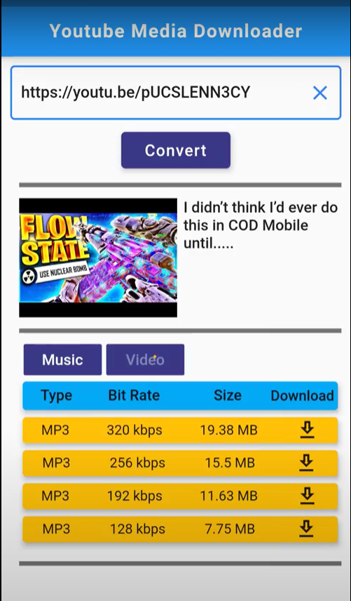

# YtFileDownloader

Flutter based application that uses API to download videos or Audios from YouTube.


## Features

- Title and Thumbnai info available.
- Convert and download videos in mp4 or mp3 format.
- Quality selection for mp4 if available [720p, 420p, ...].
- Quality Selection for mp3 if available [320kbps, 132kbps, ...].


## Dependencies

- web_scraper:
- flutter_downloader: 1.5.2
- cupertino_icons: 1.0.0
- permission_handler: 5.0.1+1
- downloads_path_provider: 0.1.0
- flutter_spinkit: 4.1.2+1
## Deployment

To deploy this project download this folder and run 

```bash
  main.dart   // First install all neccessary dependencies listed above or in pubspec file.
```


## Demo

Demo Video:

https://drive.google.com/file/d/1oQGVARdWbFVWyIsj8uXUFlC6kjCRCAzx/view?usp=sharing

## Screenshots




## Lessons Learned

Learned how to work with async data coming form API and how to present it dynamically.
## Authors

- [@DhruvDholakia](https://www.github.com/DhruvDholakiaCE)

